# PMS Integration - Architecture & Diagrams

**SCRUM-108: PMS Integration Documentation**  
**Visual Guide with Mermaid Diagrams**

---

## 🏗️ System Architecture

### High-Level Architecture

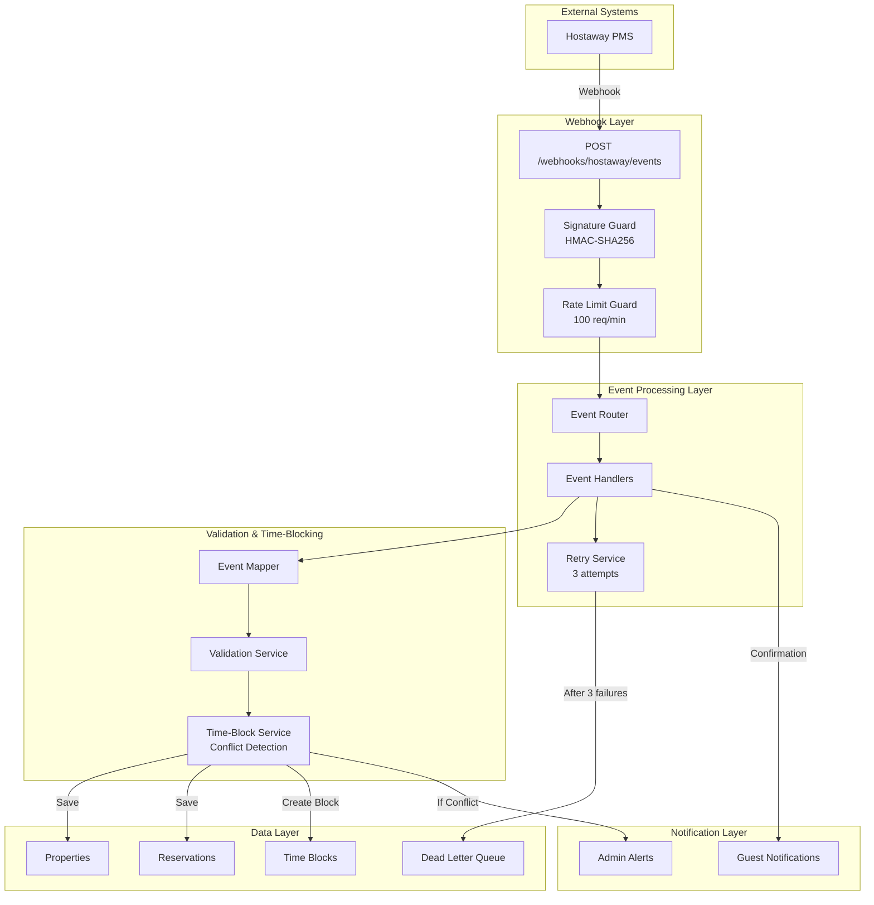

---

## 🔄 Complete Event Processing Flow

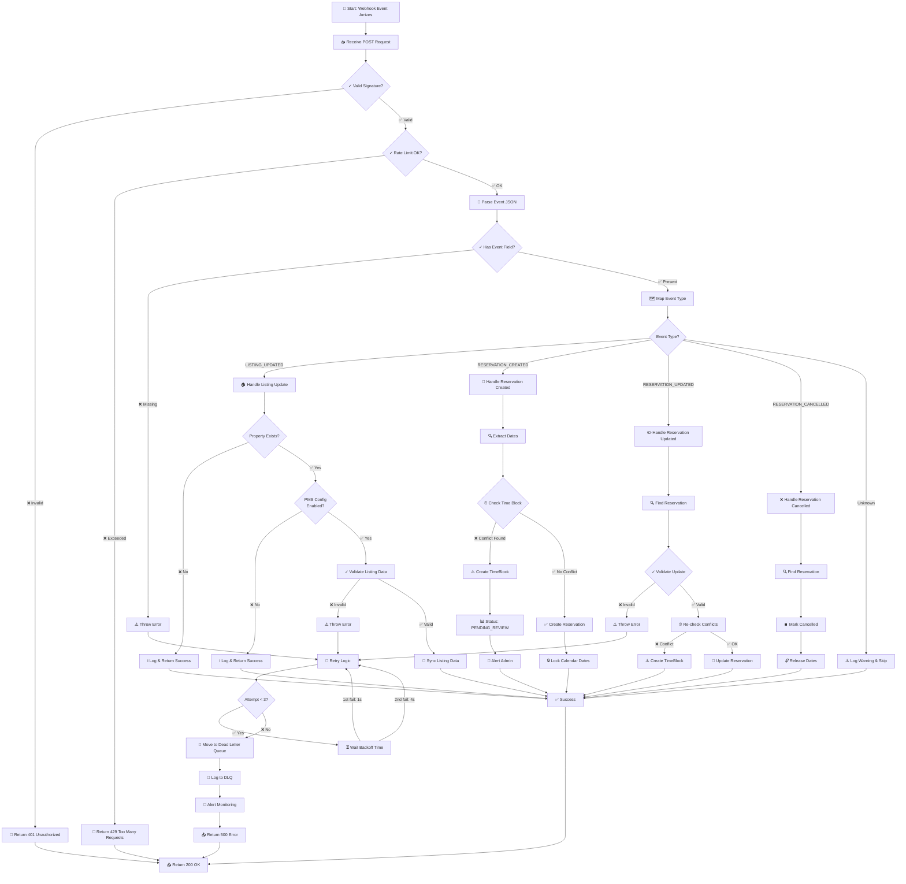

---

## ⏰ Time-Blocking Decision Tree

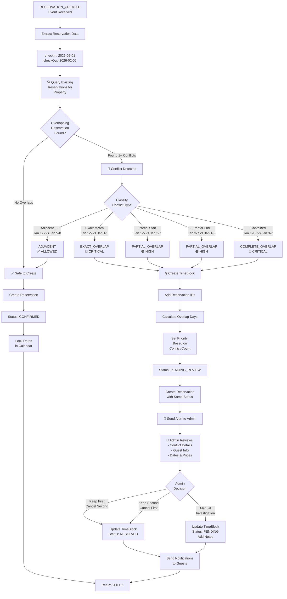

---

## 🎯 Conflict Type Matrix

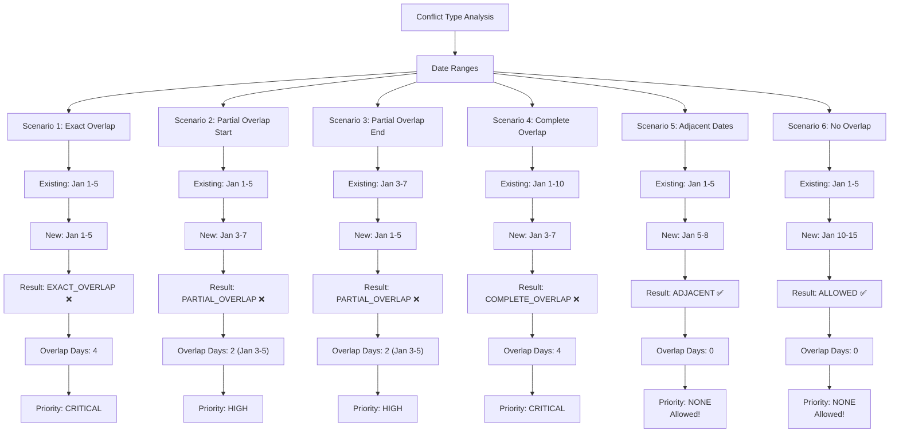

---

## 📊 Data Flow Diagram

```mermaid
graph LR
    subgraph Input["Input"]
        HA["Hostaway<br/>Webhook"]
    end
    
    subgraph Parse["Parsing"]
        P1["Extract Event Data"]
        P2["Validate JSON"]
        P3["Map Event Type"]
    end
    
    subgraph Query["Database Query"]
        Q1["Query Property by ID"]
        Q2["Query Reservations"]
        Q3["Query Time Blocks"]
    end
    
    subgraph Transform["Transformation"]
        T1["Convert Data Types"]
        T2["Calculate Derived Fields"]
        T3["Map to Internal Schema"]
    end
    
    subgraph Decision["Decision Logic"]
        D1["Validate Data"]
        D2["Check Conflicts"]
        D3["Classify Conflict"]
    end
    
    subgraph Store["Storage"]
        S1["Save Property"]
        S2["Save Reservation"]
        S3["Save TimeBlock"]
        S4["Save DLQ Entry"]
    end
    
    subgraph Notify["Notifications"]
        N1["Alert Admin"]
        N2["Notify Guest"]
        N3["Log Metrics"]
    end
    
    HA --> P1
    P1 --> P2
    P2 --> P3
    
    P3 --> Q1
    Q1 --> Q2
    Q2 --> Q3
    
    Q3 --> T1
    T1 --> T2
    T2 --> T3
    
    T3 --> D1
    D1 --> D2
    D2 --> D3
    
    D3 -->|OK| S1
    D3 -->|Conflict| S3
    S1 --> S2
    S2 --> N1
    D3 -->|Error| S4
    S4 --> N3
    S3 --> N1
    N1 --> N2
```

---

## 🔀 Retry Flow with Backoff

```mermaid
graph TD
    A["Webhook Processing<br/>Attempt 1"] --> B{"Processing<br/>Successful?"}
    B -->|✅ Yes| C["Return 200 OK"]
    B -->|❌ No| D["Log Error"]
    D --> E["Increment Attempt Counter"]
    E --> F{"Attempt < 3?"}
    F -->|❌ No (3rd failure)| G["Move to Dead Letter Queue"]
    G --> G1["Log DLQ Entry"]
    G1 --> G2["Send Alert"]
    G2 --> H["Return 500 Error"]
    F -->|✅ Yes| I{"Which Attempt?"}
    I -->|1st Attempt| J1["Wait 1 second"]
    I -->|2nd Attempt| J2["Wait 4 seconds"]
    J1 --> K["Retry from Step A"]
    J2 --> K
    K --> A
    C --> END["End"]
    H --> END
```

---

## 👥 Admin Resolution Workflow

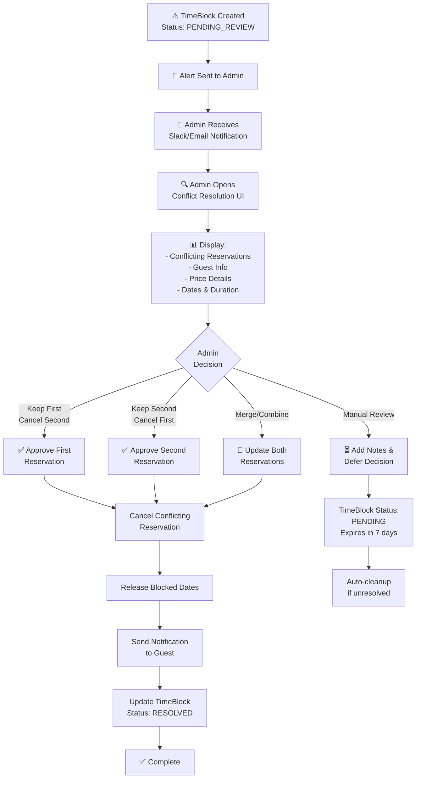

---

## 📈 Monitoring & Metrics Dashboard

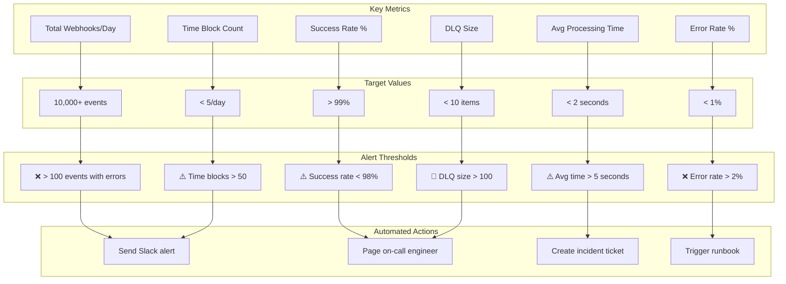

---

## 🔐 Security Validation Flow

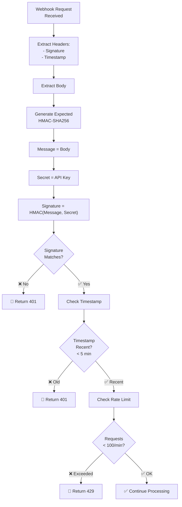

---

## 📦 Error Handling State Machine

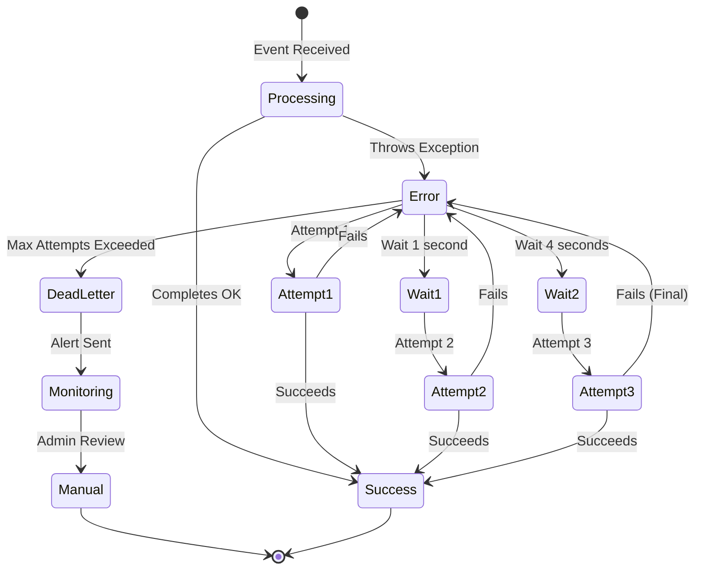

---

## 📊 Property & Reservation Entity Relationship

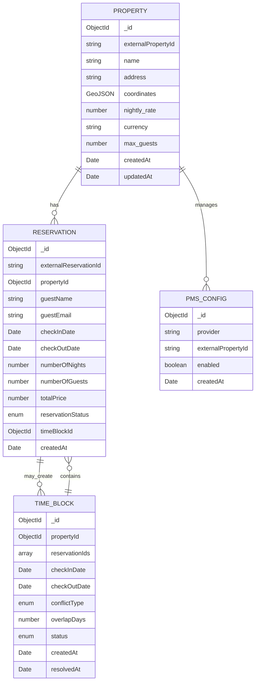

---

## 🚀 Deployment Architecture

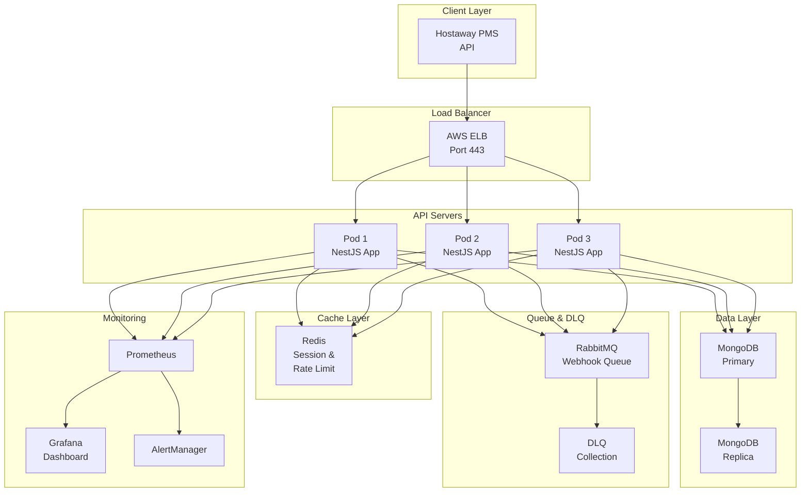

---

## 🎯 Implementation Timeline

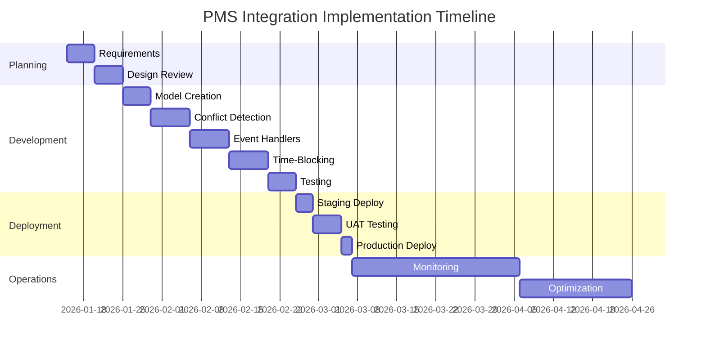

---

**Visual Guide Created**: January 29, 2026  
**Diagrams**: 15+ Mermaid diagrams  
**Coverage**: Complete architecture, flows, and workflows
