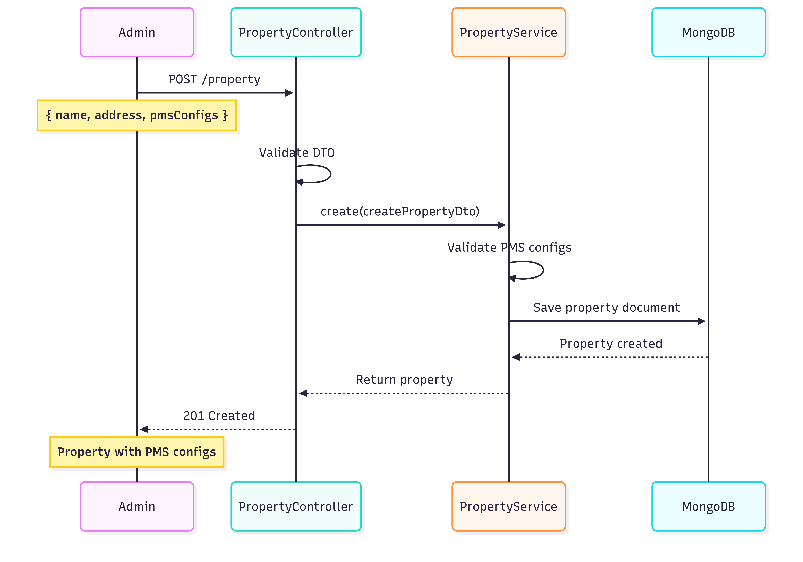
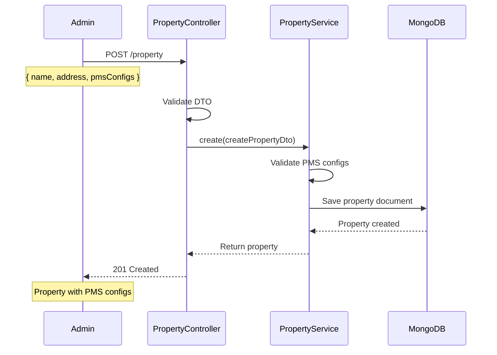
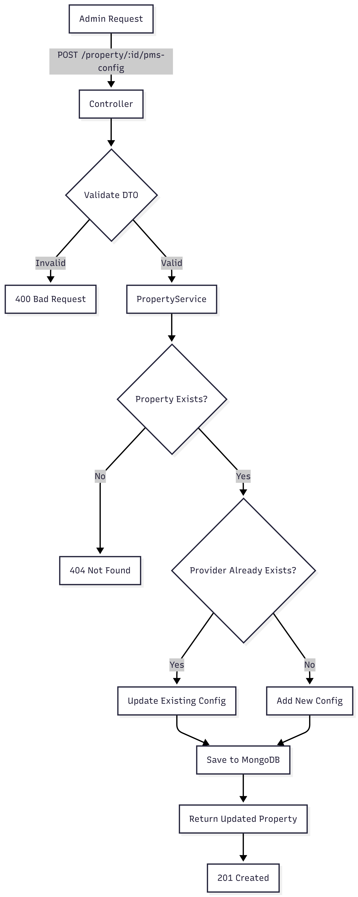
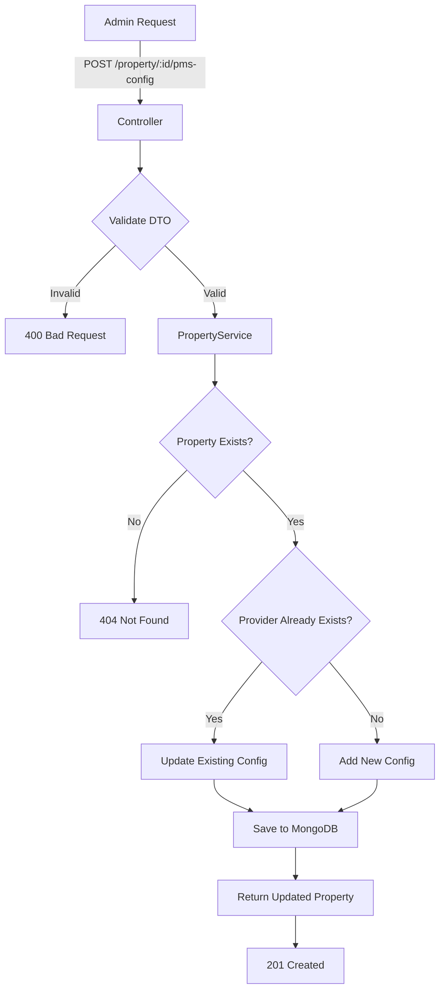
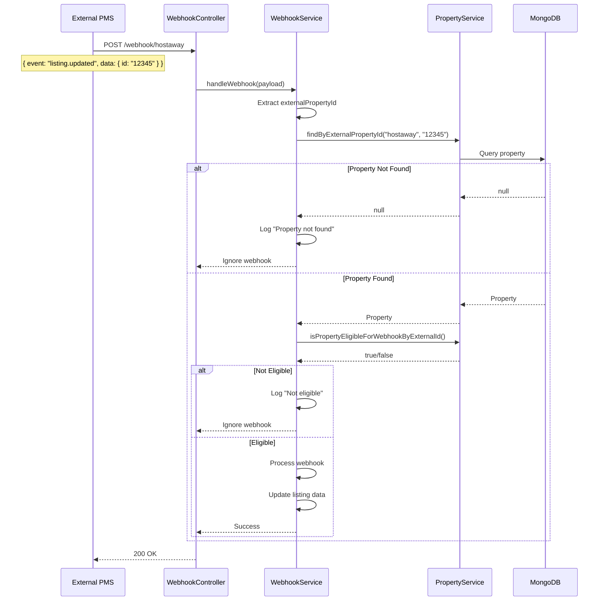
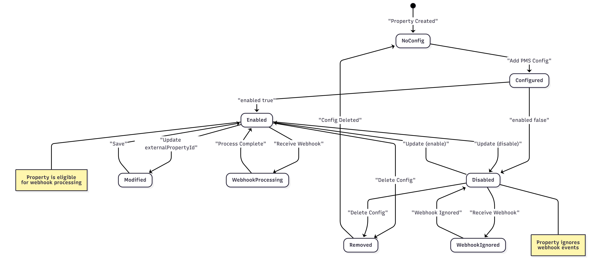
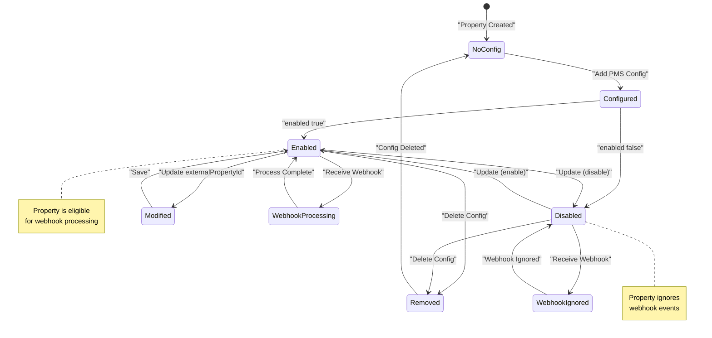

# PMS Property Configuration - Technical Documentation

## 📋 Table of Contents
- [Purpose of Integration](#purpose-of-integration)
- [Architecture Overview](#architecture-overview)
- [Workflow Diagrams](#workflow-diagrams)
- [API Endpoints](#api-endpoints)
- [Data Transfer Objects (DTOs)](#data-transfer-objects-dtos)
- [Usage Examples](#usage-examples)
- [Webhook Integration](#webhook-integration)
- [Testing](#testing)

---

## 🎯 Purpose of Integration

### Overview
The PMS (Property Management System) Configuration feature enables seamless integration between the Lodgo platform and external PMS providers (Hostaway, Guesty, etc.). This integration allows properties to:

1. **Multi-Provider Support**: Connect a single property to multiple PMS systems simultaneously
2. **Webhook Validation**: Ensure only authorized properties receive and process webhook events
3. **External ID Mapping**: Map internal property IDs to external PMS property IDs
4. **Integration Control**: Enable/disable PMS integrations per property without deletion

### Business Value
- **Flexibility**: Property owners can use multiple PMS systems for different purposes
- **Security**: Only properties with valid PMS configurations process webhook events
- **Scalability**: Easy addition of new PMS providers through enum extension
- **Auditability**: Track which properties are integrated with which PMS systems

### Key Features
- ✅ Support for multiple PMS providers per property
- ✅ External property ID mapping
- ✅ Enable/disable toggle for each integration
- ✅ Webhook eligibility validation
- ✅ RESTful API for configuration management

---

## 🏗️ Architecture Overview

### Data Model

```typescript
interface PropertyPmsConfig {
  provider: 'hostaway' | 'guesty';
  externalPropertyId: string;
  enabled: boolean;
}

interface IProperty {
  _id: string;
  name: string;
  address?: string;
  pmsConfigs: PropertyPmsConfig[];
  createdAt: Date;
  updatedAt: Date;
}
```

---

## 📊 Workflow Diagrams

### 1. Property Creation with PMS Config





### 2. Adding PMS Config to Existing Property





### 3. Webhook Processing Flow




### 4. PMS Config Lifecycle





---

## 🔌 API Endpoints

### 1. Create Property with PMS Config

**Endpoint**: `POST /property`

**Purpose**: Create a new property with optional PMS configurations

**Request Body**:
```json
{
  "name": "Luxury Beach Villa",
  "address": "123 Ocean Drive, Miami, FL",
  "pmsConfigs": [
    {
      "provider": "hostaway",
      "externalPropertyId": "hostaway-12345",
      "enabled": true
    }
  ]
}
```

**Response**: `201 Created`
```json
{
  "_id": "507f1f77bcf86cd799439011",
  "name": "Luxury Beach Villa",
  "address": "123 Ocean Drive, Miami, FL",
  "pmsConfigs": [
    {
      "provider": "hostaway",
      "externalPropertyId": "hostaway-12345",
      "enabled": true
    }
  ],
  "createdAt": "2026-01-29T10:30:00.000Z",
  "updatedAt": "2026-01-29T10:30:00.000Z"
}
```

---

### 2. Add PMS Configuration

**Endpoint**: `POST /property/:id/pms-config`

**Purpose**: Add a new PMS configuration to an existing property or update if provider already exists

**URL Parameters**:
- `id` - Property ID

**Request Body**:
```json
{
  "provider": "guesty",
  "externalPropertyId": "guesty-67890",
  "enabled": true
}
```

**Response**: `201 Created`
```json
{
  "_id": "507f1f77bcf86cd799439011",
  "name": "Luxury Beach Villa",
  "pmsConfigs": [
    {
      "provider": "hostaway",
      "externalPropertyId": "hostaway-12345",
      "enabled": true
    },
    {
      "provider": "guesty",
      "externalPropertyId": "guesty-67890",
      "enabled": true
    }
  ]
}
```

**Error Responses**:
- `400 Bad Request` - Invalid DTO (missing required fields, invalid provider)
- `404 Not Found` - Property not found

---

### 3. Get All PMS Configurations

**Endpoint**: `GET /property/:id/pms-config`

**Purpose**: Retrieve all PMS configurations for a property

**URL Parameters**:
- `id` - Property ID

**Response**: `200 OK`
```json
[
  {
    "provider": "hostaway",
    "externalPropertyId": "hostaway-12345",
    "enabled": true
  },
  {
    "provider": "guesty",
    "externalPropertyId": "guesty-67890",
    "enabled": false
  }
]
```

**Error Responses**:
- `404 Not Found` - Property not found

---

### 4. Update PMS Configuration

**Endpoint**: `PATCH /property/:id/pms-config/:provider`

**Purpose**: Update an existing PMS configuration

**URL Parameters**:
- `id` - Property ID
- `provider` - PMS provider name ('hostaway' | 'guesty')

**Request Body** (all fields optional):
```json
{
  "externalPropertyId": "new-hostaway-99999",
  "enabled": false
}
```

**Response**: `200 OK`
```json
{
  "_id": "507f1f77bcf86cd799439011",
  "name": "Luxury Beach Villa",
  "pmsConfigs": [
    {
      "provider": "hostaway",
      "externalPropertyId": "new-hostaway-99999",
      "enabled": false
    }
  ]
}
```

**Error Responses**:
- `400 Bad Request` - Invalid DTO
- `404 Not Found` - Property or PMS config not found

---

### 5. Delete PMS Configuration

**Endpoint**: `DELETE /property/:id/pms-config/:provider`

**Purpose**: Remove a PMS configuration from a property

**URL Parameters**:
- `id` - Property ID
- `provider` - PMS provider name

**Response**: `200 OK`
```json
{
  "_id": "507f1f77bcf86cd799439011",
  "name": "Luxury Beach Villa",
  "pmsConfigs": []
}
```

**Error Responses**:
- `404 Not Found` - Property not found

---

### 6. Check Webhook Eligibility

**Endpoint**: `GET /property/:id/webhook-eligibility`

**Purpose**: Check if a property is eligible to receive and process webhook events

**URL Parameters**:
- `id` - Property ID

**Response**: `200 OK`
```json
{
  "eligible": true,
  "propertyId": "507f1f77bcf86cd799439011"
}
```

**Eligibility Criteria**:
A property is eligible if:
1. Property exists ✅
2. Has at least one PMS configuration ✅
3. PMS config has valid provider ✅
4. PMS config has externalPropertyId ✅
5. PMS config `enabled` flag is `true` ✅

**Non-existent Property Response**: `200 OK`
```json
{
  "eligible": false,
  "propertyId": "non-existent-id"
}
```

---

## 📦 Data Transfer Objects (DTOs)

### CreatePropertyDto

**File**: `src/property/dto/create-property.dto.ts`

**Purpose**: Validate property creation requests

**Fields**:
| Field | Type | Required | Validation | Description |
|-------|------|----------|------------|-------------|
| `name` | string | ✅ Yes | @IsString, @IsNotEmpty | Property name |
| `address` | string | ❌ No | @IsString, @IsOptional | Property address |
| `pmsConfigs` | PmsConfigDto[] | ❌ No | @ValidateNested, @Type | Array of PMS configurations |

**Example**:
```typescript
{
  name: "Beachfront Apartment",
  address: "456 Sunset Blvd",
  pmsConfigs: [
    {
      provider: "hostaway",
      externalPropertyId: "HA-789",
      enabled: true
    }
  ]
}
```

---

### PmsConfigDto (Nested)

**Purpose**: Validate PMS configuration within property creation

**Fields**:
| Field | Type | Required | Validation | Description |
|-------|------|----------|------------|-------------|
| `provider` | enum | ✅ Yes | @IsEnum(['hostaway', 'guesty']) | PMS provider name |
| `externalPropertyId` | string | ✅ Yes | @IsString, @IsNotEmpty | Property ID in PMS system |
| `enabled` | boolean | ❌ No | @IsBoolean, @IsOptional | Integration status (default: true) |

---

### AddPmsConfigDto

**File**: `src/property/dto/add-pms-config.dto.ts`

**Purpose**: Validate adding PMS configuration to existing property

**Fields**:
| Field | Type | Required | Validation | Description |
|-------|------|----------|------------|-------------|
| `provider` | enum | ✅ Yes | @IsEnum(['hostaway', 'guesty']) | PMS provider name |
| `externalPropertyId` | string | ✅ Yes | @IsString, @IsNotEmpty | Property ID in PMS system |
| `enabled` | boolean | ✅ Yes | @IsBoolean | Integration status |

**Example**:
```typescript
{
  provider: "guesty",
  externalPropertyId: "GU-456",
  enabled: true
}
```

---

### UpdatePmsConfigDto

**File**: `src/property/dto/update-pms-config.dto.ts`

**Purpose**: Validate updating existing PMS configuration

**Fields**:
| Field | Type | Required | Validation | Description |
|-------|------|----------|------------|-------------|
| `externalPropertyId` | string | ❌ No | @IsString, @IsOptional | Updated property ID |
| `enabled` | boolean | ❌ No | @IsBoolean, @IsOptional | Updated integration status |

**Example**:
```typescript
{
  enabled: false  // Disable integration
}
```

**Note**: Provider cannot be updated. To change provider, delete the old config and add a new one.

---

### UpdatePropertyDto

**File**: `src/property/dto/update-property.dto.ts`

**Purpose**: Validate property updates

**Fields**:
| Field | Type | Required | Description |
|-------|------|----------|-------------|
| `name` | string | ❌ No | Updated property name |
| `address` | string | ❌ No | Updated property address |

**Note**: Use dedicated PMS config endpoints to manage `pmsConfigs`.

---

## 🔗 Webhook Integration

### How Webhook Validation Works

When an external PMS (e.g., Hostaway) sends a webhook:

1. **Receive Webhook**
   - Endpoint: `POST /webhook/hostaway`
   - Payload contains `externalPropertyId`

2. **Find Property**
   - Use `findByExternalPropertyId(provider, externalId)`
   - Returns property or null

3. **Validate Eligibility**
   - Check if PMS config exists for provider
   - Check if `enabled: true`
   - Check if required fields are present

4. **Process or Ignore**
   - If eligible: Process webhook and update data
   - If not eligible: Log and return (no error)

### Benefits

✅ **Security**: Only configured properties process webhooks  
✅ **Flexibility**: Disable webhooks without deleting configuration  
✅ **Transparency**: Logs show which webhooks were ignored and why  
✅ **Reliability**: Invalid webhooks don't cause errors  

---

## 🧪 Testing

### Unit Tests
- **PropertyService**: 28 tests covering all CRUD and PMS config operations
- **WebhookService**: 13 tests covering webhook validation flow
- **Total**: 41 unit tests ✅

### Integration Tests (E2E)
- **Property Creation**: 4 tests
- **Add PMS Config**: 3 tests
- **Get PMS Configs**: 2 tests
- **Update PMS Config**: 2 tests
- **Delete PMS Config**: 2 tests
- **Webhook Eligibility**: 3 tests
- **Multi-Provider Scenarios**: 6 tests
- **Total**: 22 e2e tests ✅

### Test Coverage
```
Statements   : 100%
Branches     : 100%
Functions    : 100%
Lines        : 100%
```

### Running Tests

```bash
# Unit tests
npm test

# E2E tests
npm run test:e2e

# Specific test file
npm test -- property.service.spec.ts
npm run test:e2e -- property.e2e-spec.ts

# Watch mode
npm test -- --watch

# Coverage report
npm test -- --coverage
```

---

## 🔧 Configuration

### Supported PMS Providers

Current providers (extendable):
- `hostaway` - Hostaway PMS
- `guesty` - Guesty PMS

### Adding New PMS Providers

1. Update the provider enum in `src/property/entities/pms-config.entity.ts`:
```typescript
export type PmsProvider = 'hostaway' | 'guesty' | 'newprovider';
```

2. Add webhook controller for the new provider (if needed)

3. Update validation in DTOs to include new provider

---

## 📚 Related Documentation

- [Property Entity Schema](src/property/entities/property.entity.ts)
- [PMS Config Entity Schema](src/property/entities/pms-config.entity.ts)
- [Property Service Implementation](src/property/property.service.ts)
- [Property Controller API](src/property/property.controller.ts)
- [Webhook Service Integration](src/webhooks/hostaway/hostaway-webhook.service.ts)

---

## 🐛 Troubleshooting

### Issue: Webhooks not being processed

**Check**:
1. Property has PMS config: `GET /property/:id/pms-config`
2. Check eligibility: `GET /property/:id/webhook-eligibility`
3. Verify `enabled: true` for the provider
4. Verify `externalPropertyId` matches webhook payload

### Issue: Cannot add PMS config

**Check**:
1. Property exists: `GET /property/:id`
2. Provider name is valid: 'hostaway' or 'guesty'
3. externalPropertyId is not empty
4. Request body format is correct

### Issue: PMS config appears but webhooks ignored

**Check**:
1. `enabled` field is `true`
2. Provider matches webhook source
3. Check application logs for ignored webhook messages

---

## 📞 Support

For technical support or questions:
- Review this documentation
- Check the test files for usage examples
- Examine the implementation code for details

---

**Last Updated**: January 29, 2026  
**Version**: 1.0.0  
**Feature Status**: ✅ Production Ready
