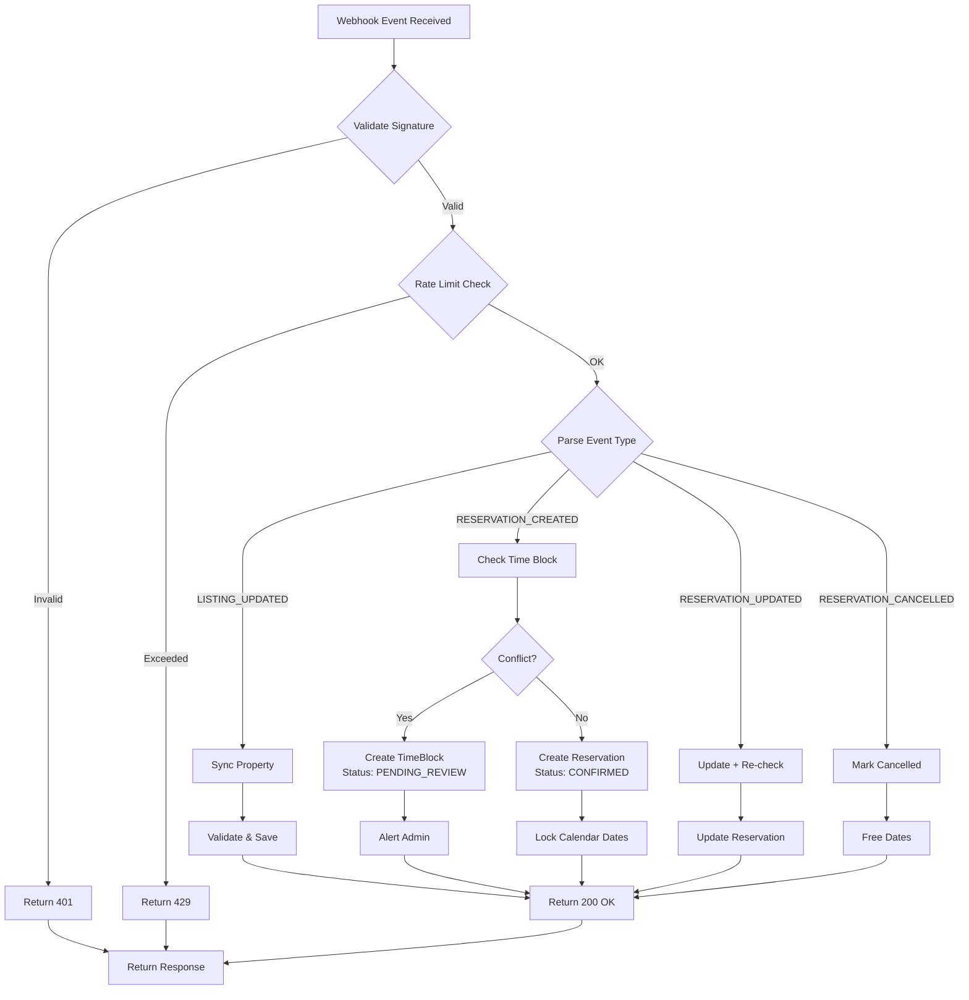
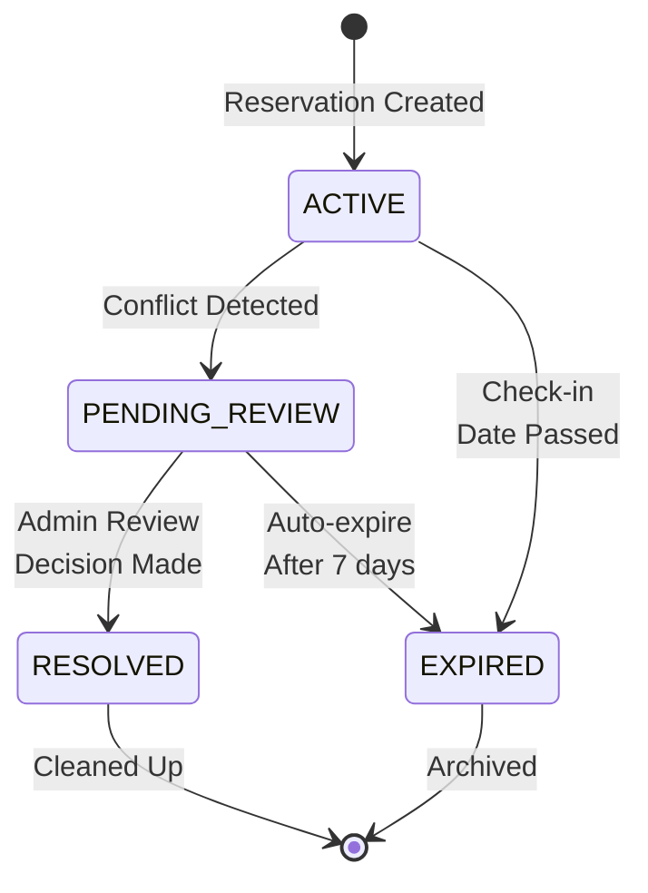

# PMS Integration Documentation Index

**Status**: SCRUM-108 - PMS Integration Documentation  
**Branch**: `feature/SCRUM-108_pms_integration_documentation`  
**Last Updated**: January 29, 2026  
**Version**: 1.0.0

---

## 📚 Documentation Overview

This directory contains comprehensive documentation for the Hostaway PMS webhook integration, including webhook endpoints, event handling, property mapping, and duplicate reservation prevention through time-blocking.

### Quick Links

| Document | Purpose | Audience |
|----------|---------|----------|
| [PMS-WEBHOOK-INTEGRATION.md](./PMS-WEBHOOK-INTEGRATION.md) | Complete webhook integration guide | Developers, DevOps |
| [TIME-BLOCKING-ALGORITHM.md](./TIME-BLOCKING-ALGORITHM.md) | Duplicate reservation prevention | Backend Engineers, Tech Leads |
| [PROPERTY-MAPPING-SCHEMA.md](./PROPERTY-MAPPING-SCHEMA.md) | Data mapping specifications | Developers, Data Engineers |

---

## 📖 Document Descriptions

### 1. PMS Webhook Integration Documentation
**File**: `PMS-WEBHOOK-INTEGRATION.md`

Complete reference for webhook integration covering:

#### Topics:
- ✅ **Webhook Endpoints** - POST `/webhooks/hostaway/events`
- ✅ **Event Handling Flow** - Mermaid diagrams showing complete flow
- ✅ **Event Types** - LISTING_UPDATED, RESERVATION_CREATED, RESERVATION_UPDATED, RESERVATION_CANCELLED
- ✅ **Property Mapping** - How Hostaway data maps to internal schema
- ✅ **Error Handling** - Retry logic (3 attempts), exponential backoff
- ✅ **Dead Letter Queue** - Failed webhook handling
- ✅ **Time-Blocking** - Duplicate reservation prevention
- ✅ **Monitoring & Logging** - Key metrics and structured logging
- ✅ **Testing Checklist** - Validation requirements

#### Key Sections:
```
1. Webhook Endpoints
2. Event Handling Flow (with Mermaid diagram)
3. Event Types & Processing
4. Property Mapping Requirements
5. Error Handling & Retry Logic
6. Time-Blocking Implementation Details
7. API Response Examples
8. Monitoring & Logging
9. Testing & Validation
10. Future Enhancements
```

---

### 2. Time-Blocking Algorithm for Duplicate Reservation Prevention
**File**: `TIME-BLOCKING-ALGORITHM.md`

Detailed technical specification for preventing duplicate reservations:

#### Key Concepts:
- **Problem Statement** - Why duplicates occur with async webhooks
- **Solution Architecture** - TimeBlock model and workflow
- **Detection Algorithm** - 4-step process with JavaScript examples
- **Conflict Classification** - EXACT_OVERLAP, PARTIAL_OVERLAP, ADJACENT
- **Time-Block States** - ACTIVE → PENDING_REVIEW → RESOLVED/EXPIRED
- **Resolution Workflow** - Manual review + future auto-resolution
- **Database Indexes** - Optimized queries for date ranges
- **Edge Cases** - Race conditions, concurrent updates, etc.

#### Flow Diagram:
```
RESERVATION_CREATED Event
    ↓
Extract Dates (checkIn, checkOut)
    ↓
Query Conflicting Reservations
    ↓
Classify Conflict Type (if any)
    ↓
IF Conflict Found:
    → Create TimeBlock (PENDING_REVIEW)
    → Create Reservation (PENDING_REVIEW status)
    → Alert Admin Team
    ↓
ELSE:
    → Create Reservation (CONFIRMED)
    → Lock Dates in Calendar
    ↓
Return Response
```

#### Conflict Types:
| Type | Example | Status |
|------|---------|--------|
| EXACT_OVERLAP | Jan 1-5 vs Jan 1-5 | ❌ CONFLICT |
| PARTIAL_OVERLAP | Jan 1-5 vs Jan 3-7 | ❌ CONFLICT |
| COMPLETE_OVERLAP | Jan 1-10 vs Jan 3-7 | ❌ CONFLICT |
| ADJACENT | Jan 1-5 vs Jan 5-8 | ✅ ALLOWED |

---

### 3. Property Mapping Schema & Requirements
**File**: `PROPERTY-MAPPING-SCHEMA.md`

Data mapping specifications and transformation logic:

#### Content:
- **Property Entity Mapping** - Hostaway → Internal schema
- **Reservation Entity Mapping** - Booking data transformation
- **PMS Configuration** - Integration settings and credentials
- **Data Transformation Examples** - Real-world examples
- **Enumeration Mappings** - Status values, payment states
- **Data Type Conversions** - Date/DateTime, coordinates, currency
- **Validation Rules** - Required fields and constraints
- **Testing Examples** - Unit test patterns

#### Example Mappings:
```
Hostaway Field → Our Field (Type)
─────────────────────────────────
listing.id → externalPropertyId (string)
listing.name → name (string)
listing.address → address (string)
listing.lat/lng → coordinates (GeoJSON)
listing.price → nightly_rate (number)
listing.currency → currency (string)

reservationId → externalReservationId (string)
checkIn (ISO 8601) → checkInDate (Date)
checkOut (ISO 8601) → checkOutDate (Date)
status → reservationStatus (enum)
```

---

## 🔄 Event Flow Diagrams

### Complete Webhook Processing Flow



---

## 📊 Time-Blocking Status Diagram



---

## 🔑 Key Features

### ✅ Complete Integration
- All webhook event types documented
- End-to-end flow diagrams
- Real-world examples included

### ✅ Duplicate Prevention
- Time-blocking algorithm explained
- Conflict detection logic detailed
- Resolution workflows documented

### ✅ Data Consistency
- Property mapping specifications
- Type conversion rules
- Validation requirements

### ✅ Error Handling
- Retry logic with exponential backoff
- Dead letter queue management
- Monitoring and alerting guidelines

### ✅ Developer Ready
- Code examples in JavaScript/TypeScript
- Database schema definitions
- Testing patterns and checklist

---

## 🚀 Implementation Checklist

### Phase 1: Foundation
- [ ] Create TimeBlock model
- [ ] Implement conflict detection
- [ ] Add database indexes
- [ ] Write unit tests

### Phase 2: Integration
- [ ] Connect to reservation creation
- [ ] Implement event handlers
- [ ] Add monitoring metrics
- [ ] Deploy to staging

### Phase 3: Operations
- [ ] Create admin UI for conflict resolution
- [ ] Set up alerting rules
- [ ] Train team on resolution process
- [ ] Monitor production metrics

### Phase 4: Optimization
- [ ] Analyze conflict patterns
- [ ] Implement auto-resolution (if applicable)
- [ ] Optimize database queries
- [ ] Extend to other PMS providers

---

## 📈 Event Types & Processing

### Event: LISTING_UPDATED

```
Purpose: Sync property information from Hostaway
Trigger: When property details change on Hostaway
Processing: Validate → Find Property → Update Fields → Log Success
Fields Updated: name, address, nightly_rate, coordinates
Response: 200 OK with propertyId
```

### Event: RESERVATION_CREATED

```
Purpose: Create new reservation with conflict checking
Trigger: New booking confirmed in Hostaway
Processing: Extract Data → Check Time Block → Create Reservation → Notify
Time-Blocking: Query overlapping dates, create block if conflict found
Response: 200 OK with reservationId or TimeBlock reference
```

### Event: RESERVATION_UPDATED

```
Purpose: Update reservation with re-validation
Trigger: Guest modifies check-in/out dates on Hostaway
Processing: Find Reservation → Re-check Conflicts → Update → Log
Time-Blocking: Re-verify no conflicts (excluding self)
Response: 200 OK with updated reservation
```

### Event: RESERVATION_CANCELLED

```
Purpose: Cancel booking and free dates
Trigger: Reservation cancelled in Hostaway
Processing: Find Reservation → Mark Cancelled → Release Dates → Notify
Response: 200 OK with confirmation
```

---

## 🔐 Security & Validation

### Signature Validation
- All webhooks require HMAC-SHA256 signature
- Signature generated from webhook body + secret
- Guard: `HostawaySignatureGuard`

### Rate Limiting
- 100 requests per minute per property
- Guard: `WebhookRateLimitGuard`
- Returns 429 if exceeded

### Payload Validation
- Event field required
- Data structure validated
- Required fields checked per event type

---

## 📝 Error Handling

### Retry Strategy
```
Attempt 1: Fail immediately
Attempt 2: Wait 1 second, retry
Attempt 3: Wait 4 seconds, retry
Max 3 attempts → Move to Dead Letter Queue
```

### Dead Letter Queue
- Failed webhooks after 3 retries
- Stored for manual review
- Statistics tracked by provider and event type
- Admin interface for investigation

---

## 📊 Monitoring Metrics

| Metric | Target | Alert |
|--------|--------|-------|
| Success Rate | > 99% | < 98% |
| Processing Time | < 2 seconds | > 5 seconds |
| Error Rate | < 1% | > 2% |
| DLQ Size | < 10 items | > 50 items |
| Time Block Resolution | < 7 days | > 14 days |

---

## 🔗 Related Files

### Source Code
- `src/webhooks/hostaway/hostaway-webhook.service.ts` - Main webhook handler
- `src/webhooks/hostaway/hostaway-event.mapper.ts` - Event type mapping
- `src/webhooks/hostaway/services/webhook-retry.service.ts` - Retry logic
- `src/property/property.service.ts` - Property operations

### Tests
- `src/webhooks/hostaway/hostaway-webhook.service.spec.ts` - Webhook tests
- `src/webhooks/hostaway/services/webhook-retry.service.spec.ts` - Retry tests

---

## 📞 Support & Questions

### For Issues:
1. Check relevant documentation section
2. Review examples and test cases
3. Check source code for implementation details
4. Create issue with webhook payload and error details

### For Extensions:
1. Review architecture diagrams
2. Check integration points
3. Follow established patterns
4. Add tests for new functionality

---

## 📅 Version History

| Version | Date | Changes |
|---------|------|---------|
| 1.0.0 | 2026-01-29 | Initial documentation |
| | | - Webhook integration guide |
| | | - Time-blocking algorithm |
| | | - Property mapping schema |
| | | - Mermaid diagrams |
| | | - Code examples |

---

**Next Steps:**
- [ ] Review documentation with team
- [ ] Implement according to specifications
- [ ] Add project to documentation index
- [ ] Schedule team training session

---

*For updates or corrections, please create a PR with changes to this documentation.*
