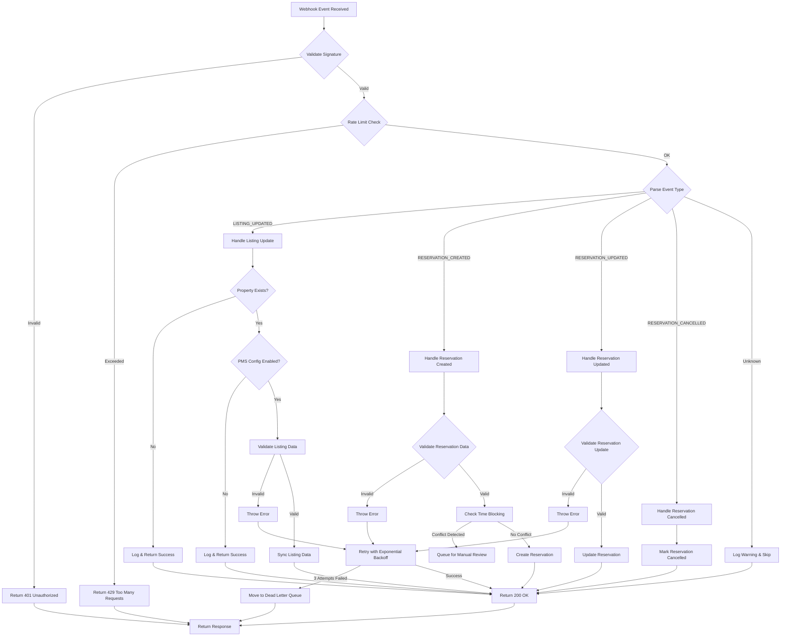
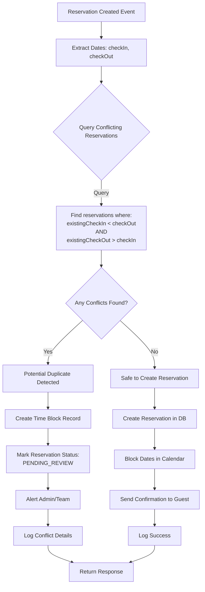
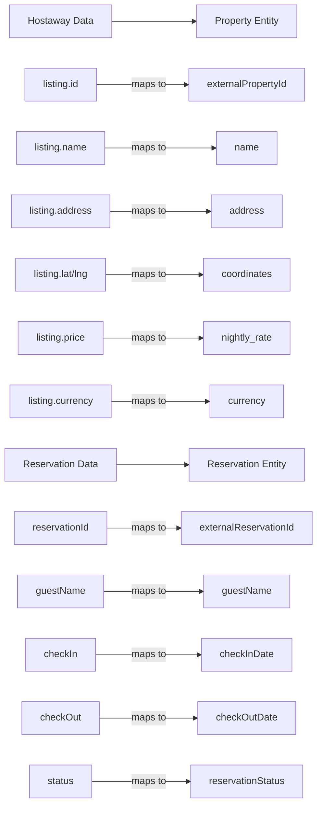
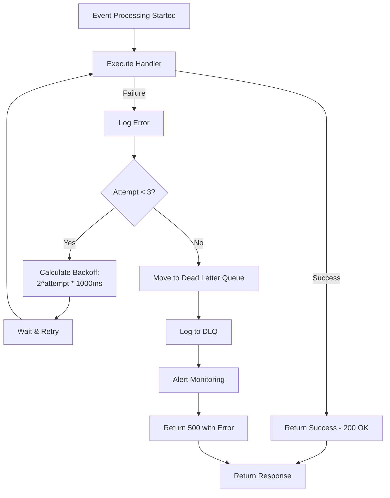
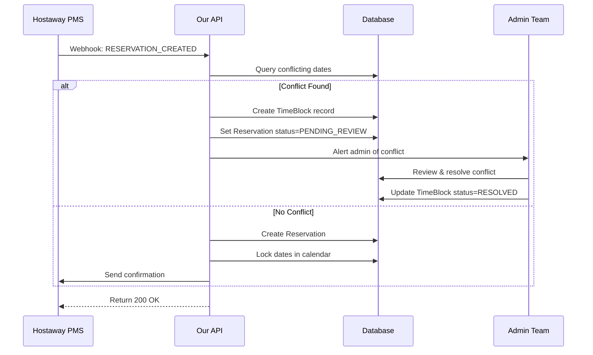
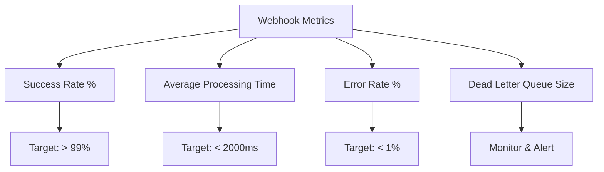

# PMS Webhook Integration Documentation

## Overview

This document outlines the Hostaway PMS webhook integration, covering webhook endpoints, event handling logic, property mapping, and reservation time-blocking mechanisms to prevent duplicate bookings.

---

## 1. Webhook Endpoints

### Hostaway Webhook Endpoint

**Base URL**: `/webhooks/hostaway`

| Method | Endpoint | Purpose |
|--------|----------|---------|
| POST | `/webhooks/hostaway/events` | Receive and process Hostaway webhook events |

### Request Structure

```json
{
  "event": "listing.updated|reservation.created|reservation.updated|reservation.cancelled",
  "data": {
    "id": "external_property_id",
    "name": "Property Name",
    "address": "Property Address",
    "externalListingName": "Hostaway Listing Name",
    "price": 100.00,
    "guestsIncluded": 2,
    "currencyCode": "USD",
    "personCapacity": 4,
    "lat": 40.7128,
    "lng": -74.0060,
    "specialStatus": "completed",
    // Reservation-specific fields
    "reservationId": "RES12345",
    "guestName": "John Doe",
    "checkIn": "2026-02-01",
    "checkOut": "2026-02-05",
    "status": "confirmed"
  }
}
```

### Security

- **Signature Validation**: All incoming webhooks must be validated using the Hostaway signature guard
- **Rate Limiting**: 100 requests per minute per property
- **Timeout**: 30 seconds request timeout

---

## 2. Event Handling Flow



---

## 3. Event Types & Processing

### 3.1 LISTING_UPDATED Event

**Purpose**: Sync property listing information from Hostaway

**Processing Steps**:
1. Extract external property ID from event data
2. Find property by external ID and provider
3. Verify PMS configuration is enabled
4. Validate listing data (required fields + completed status)
5. Sync listing data to property document
6. Log success

**Required Fields**:
- `id` - External property ID
- `name` - Property name
- `address` - Property address
- `externalListingName` - Hostaway listing name
- `price` - Price per night
- `guestsIncluded` - Number of included guests
- `currencyCode` - Currency code (e.g., USD)
- `personCapacity` - Max guest capacity
- `lat` - Latitude coordinate
- `lng` - Longitude coordinate
- `specialStatus` - Must be "completed"

**Properties Updated**:
- `name` - Property name
- `address` - Property address
- `updatedAt` - Timestamp of update

---

### 3.2 RESERVATION_CREATED Event

**Purpose**: Create new reservation and check for conflicts using time-blocking

**Processing Steps**:
1. Extract reservation data (ID, guest name, check-in, check-out)
2. Find property by external ID
3. **TIME-BLOCKING CHECK**: Verify no overlapping reservations
4. Create reservation record
5. Update property availability calendar
6. Send confirmation notification
7. Log reservation creation

**Required Fields**:
- `reservationId` - Hostaway reservation ID
- `id` - External property ID
- `guestName` - Guest name
- `checkIn` - Check-in date (ISO 8601)
- `checkOut` - Check-out date (ISO 8601)
- `status` - Reservation status

**Time-Blocking Logic**:



**Time Block Record Structure**:

```typescript
interface TimeBlock {
  _id: ObjectId;
  propertyId: string;
  reservationIds: string[];  // Multiple conflicting reservation IDs
  checkIn: Date;
  checkOut: Date;
  status: 'PENDING_REVIEW' | 'RESOLVED' | 'IGNORED';
  conflictType: 'EXACT_OVERLAP' | 'PARTIAL_OVERLAP' | 'ADJACENT';
  createdAt: Date;
  resolvedAt?: Date;
  resolvedBy?: string;
  notes?: string;
}
```

**Conflict Detection Scenarios**:

| Scenario | Example | Status |
|----------|---------|--------|
| **Exact Overlap** | Existing: Jan 1-5, New: Jan 1-5 | CONFLICT ❌ |
| **Partial Overlap Start** | Existing: Jan 1-5, New: Jan 3-7 | CONFLICT ❌ |
| **Partial Overlap End** | Existing: Jan 3-7, New: Jan 1-5 | CONFLICT ❌ |
| **Complete Overlap** | Existing: Jan 1-10, New: Jan 3-7 | CONFLICT ❌ |
| **Adjacent Dates** | Existing: Jan 1-5, New: Jan 5-8 | ALLOWED ✅ |
| **No Overlap** | Existing: Jan 1-5, New: Jan 10-15 | ALLOWED ✅ |

---

### 3.3 RESERVATION_UPDATED Event

**Purpose**: Update existing reservation with conflict re-checking

**Processing Steps**:
1. Find reservation by Hostaway reservation ID
2. Extract updated data (dates, guest info, status)
3. **TIME-BLOCKING CHECK**: Verify updated dates don't conflict (excluding self)
4. Update reservation record
5. Recalculate property availability
6. Send update notification
7. Log reservation update

**Updatable Fields**:
- `guestName` - Guest name
- `checkIn` - Check-in date
- `checkOut` - Check-out date
- `status` - Reservation status
- `notes` - Special guest notes

**Time-Blocking Re-check**:
- When dates change, must re-verify no conflicts with OTHER reservations
- Self-exclusion: Don't compare against the same reservation

---

### 3.4 RESERVATION_CANCELLED Event

**Purpose**: Cancel reservation and free up dates

**Processing Steps**:
1. Find reservation by Hostaway reservation ID
2. Update status to "CANCELLED"
3. Remove time blocks associated with this reservation
4. Free dates in property calendar
5. Send cancellation notification
6. Log cancellation

**Actions**:
- Mark reservation as cancelled
- Release blocked dates
- Clean up time block records
- Notify property manager

---

## 4. Property Mapping Requirements

### Property Schema Mapping



### Property Configuration

```typescript
interface PropertyPmsConfig {
  provider: 'hostaway' | 'guesty' | 'airbnb';
  externalPropertyId: string;
  enabled: boolean;
  syncListings: boolean;
  syncReservations: boolean;
  timeBlockingEnabled: boolean;
  notificationEmail?: string;
  createdAt: Date;
  updatedAt: Date;
}
```

### Reservation Schema

```typescript
interface Reservation {
  _id: ObjectId;
  propertyId: string;
  externalReservationId: string;  // Hostaway ID
  provider: string;                // 'hostaway'
  guestName: string;
  checkInDate: Date;
  checkOutDate: Date;
  numberOfNights: number;
  numberOfGuests: number;
  totalPrice: number;
  currency: string;
  reservationStatus: 'PENDING_REVIEW' | 'CONFIRMED' | 'CANCELLED';
  createdAt: Date;
  updatedAt: Date;
  cancelledAt?: Date;
  notes?: string;
}
```

---

## 5. Error Handling & Retry Logic

### Retry Strategy



### Retry Configuration

| Setting | Value | Description |
|---------|-------|-------------|
| Max Attempts | 3 | Total number of retry attempts |
| Initial Delay | 1000ms | First retry delay |
| Backoff Strategy | Exponential | 2^attempt * 1000ms |
| Max Delay | 32000ms | Maximum wait time |

### Dead Letter Queue

Failed webhooks after 3 retries are moved to a dead letter queue for:
- Manual review and investigation
- Monitoring and alerting
- Statistics and analytics

**DLQ Entry Structure**:

```typescript
interface DeadLetterQueueEntry {
  _id: ObjectId;
  provider: string;
  eventType: string;
  externalPropertyId?: string;
  errorMessage: string;
  errorStack?: string;
  attempts: number;
  timestamp: Date;
  payload?: any;
  status: 'QUEUED' | 'REVIEWED' | 'RESOLVED';
}
```

---

## 6. Time-Blocking Implementation Details

### Why Time-Blocking?

**Problem**: Duplicate reservations can occur when:
1. Guest books on Hostaway directly
2. Webhook delivery delay causes out-of-order events
3. Multiple PMS systems synchronize simultaneously
4. Network issues cause retries with stale data

**Solution**: Time-blocking creates a "reservation hold" that prevents overlapping bookings from being created during the sync window.

### Time-Blocking Process



### Date Range Query (MongoDB)

```javascript
// Query to find overlapping reservations
db.reservations.find({
  propertyId: propertyId,
  status: { $ne: 'CANCELLED' },
  $or: [
    {
      // Existing checkin is before new checkout
      checkInDate: { $lt: newCheckOut },
      // AND existing checkout is after new checkin
      checkOutDate: { $gt: newCheckIn }
    }
  ]
})
```

---

## 7. API Response Examples

### Successful Webhook Processing

```json
{
  "status": "SUCCESS",
  "eventType": "reservation.created",
  "propertyId": "507f1f77bcf86cd799439011",
  "processingTimeMs": 1250,
  "timestamp": "2026-01-29T06:30:00.000Z"
}
```

### Time-Blocking Conflict Detected

```json
{
  "status": "DEAD_LETTER",
  "eventType": "reservation.created",
  "processingTimeMs": 2500,
  "error": {
    "provider": "hostaway",
    "eventType": "reservation.created",
    "errorMessage": "Potential duplicate reservation detected for dates 2026-02-01 to 2026-02-05",
    "errorStack": "...",
    "attemptNumber": 3,
    "timestamp": "2026-01-29T06:30:00.000Z"
  }
}
```

### Validation Error

```json
{
  "status": "FAILED",
  "eventType": "reservation.created",
  "processingTimeMs": 150,
  "error": {
    "provider": "hostaway",
    "eventType": "reservation.created",
    "errorMessage": "Invalid webhook payload: missing event field",
    "attemptNumber": 1,
    "timestamp": "2026-01-29T06:30:00.000Z"
  }
}
```

---

## 8. Monitoring & Logging

### Key Metrics



### Log Structure

```json
{
  "message": "Webhook processed successfully",
  "provider": "hostaway",
  "eventType": "reservation.created",
  "propertyId": "507f1f77bcf86cd799439011",
  "processingTimeMs": 1250,
  "timestamp": "2026-01-29T06:30:00.000Z"
}
```

---

## 9. Testing & Validation

### Webhook Testing Checklist

- [ ] Valid signature required for all webhooks
- [ ] Rate limiting enforced (100 req/min)
- [ ] Unknown events logged and skipped
- [ ] Property must exist and have enabled PMS config
- [ ] Listing data validation (required fields + completed status)
- [ ] Reservation time-blocking works correctly
- [ ] Retry logic executes on failures
- [ ] Dead letter queue captures failed events
- [ ] Timestamps and logging accurate
- [ ] Proper error responses returned

### Test Cases

```javascript
describe('RESERVATION_CREATED Event', () => {
  it('should create reservation when no time conflict', () => {});
  it('should detect time conflict with existing reservation', () => {});
  it('should allow adjacent reservation dates', () => {});
  it('should retry on database errors', () => {});
  it('should move to DLQ after 3 failed attempts', () => {});
});
```

---

## 10. Future Enhancements

1. **Multi-PMS Support**: Extend to Guesty, Airbnb, VRBO
2. **Bi-directional Sync**: Push changes back to Hostaway
3. **Rate Limiting Refinement**: Per-property rate limits
4. **Time-Block Auto-Resolution**: AI-based conflict resolution
5. **Webhook Signature Rotation**: Support key rotation
6. **Batch Processing**: Process multiple events in single request

---

## References

- [Hostaway Webhook Documentation](https://www.hostaway.com/api)
- [Time-Blocking Algorithm](docs/TIME_BLOCKING_ALGORITHM.md)
- [Property Mapping Schema](docs/PROPERTY_MAPPING_SCHEMA.md)
- [Error Handling Guide](docs/ERROR_HANDLING.md)

---

**Last Updated**: January 29, 2026  
**Version**: 1.0.0  
**Status**: Active
