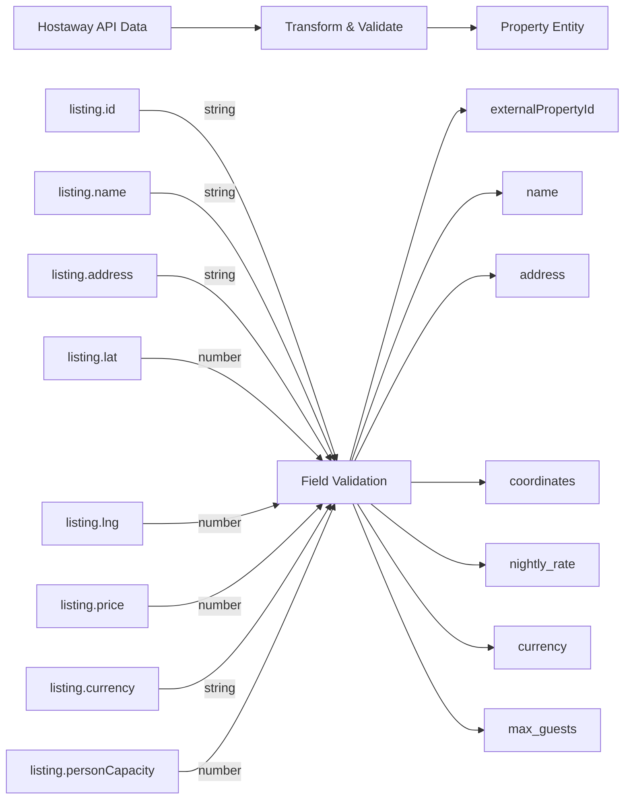

# Property Mapping Requirements & Schema

## Overview

This document defines the mapping between Hostaway PMS data and our internal property and reservation entities. It ensures consistent data synchronization and proper field transformations.

---

## 1. Property Entity Mapping

### From Hostaway to Property



### Property Schema

```typescript
interface Property {
  // Identification
  _id: ObjectId;
  externalPropertyId: string;      // From Hostaway listing.id
  provider: string;                 // 'hostaway'
  
  // Basic Information
  name: string;                     // Listing name
  description?: string;
  address: string;
  city?: string;
  state?: string;
  zipCode?: string;
  country?: string;
  
  // Location
  coordinates: {
    type: 'Point';
    coordinates: [number, number]; // [longitude, latitude]
  };
  
  // Capacity & Amenities
  max_guests: number;               // personCapacity
  num_bedrooms: number;
  num_bathrooms: number;
  pet_friendly: boolean;
  parking_available: boolean;
  
  // Pricing
  nightly_rate: number;             // listing.price
  currency: string;                 // USD, EUR, etc.
  cleaning_fee?: number;
  service_fee?: number;
  
  // Availability & Blocking
  available: boolean;
  blocked_dates: Date[];
  
  // Configuration
  pmsConfigs: PropertyPmsConfig[];  // Array of PMS integrations
  
  // Metadata
  photos: string[];
  amenities: string[];
  rules: string[];
  
  // Audit
  createdAt: Date;
  updatedAt: Date;
  lastSyncedAt: Date;
}
```

### Field Validation Rules

| Field | Type | Required | Rules |
|-------|------|----------|-------|
| externalPropertyId | string | ✅ | Min: 1, Max: 100, Unique per provider |
| name | string | ✅ | Min: 3, Max: 200, No special chars |
| address | string | ✅ | Min: 5, Max: 500 |
| max_guests | number | ✅ | Min: 1, Max: 50 |
| nightly_rate | number | ✅ | Min: 0, Decimal allowed |
| coordinates | GeoJSON | ✅ | Valid lat/lng range |
| currency | string | ✅ | ISO 4217 code (USD, EUR, etc) |

---

## 2. Reservation Entity Mapping

### From Hostaway to Reservation

```typescript
interface ReservationMapping {
  // Hostaway Field → Our Field (Type)
  reservationId: string;            // → externalReservationId
  id: string;                       // → propertyId (lookup)
  guestName: string;                // → guestName
  checkIn: string (ISO 8601);       // → checkInDate (Date)
  checkOut: string (ISO 8601);      // → checkOutDate (Date)
  status: string;                   // → reservationStatus (enum)
  totalPrice: number;               // → totalPrice
  currency: string;                 // → currency
  numberOfGuests: number;           // → numberOfGuests
  notes: string;                    // → specialRequests
}
```

### Reservation Schema

```typescript
interface Reservation {
  // Identification
  _id: ObjectId;
  externalReservationId: string;    // Hostaway reservationId
  propertyId: ObjectId;             // Reference to Property
  provider: string;                 // 'hostaway'
  
  // Guest Information
  guestName: string;
  guestEmail?: string;
  guestPhone?: string;
  
  // Dates
  checkInDate: Date;                // ISO 8601 converted to Date
  checkOutDate: Date;               // ISO 8601 converted to Date
  numberOfNights: number;           // Calculated: checkOut - checkIn
  
  // Occupancy
  numberOfGuests: number;
  numberOfChildren?: number;
  numberOfAdults?: number;
  
  // Pricing
  totalPrice: number;
  pricePerNight?: number;
  currency: string;
  cleaningFee?: number;
  serviceFee?: number;
  
  // Status
  reservationStatus: 'CONFIRMED' | 'PENDING' | 'CANCELLED' | 'PENDING_REVIEW';
  paymentStatus: 'PAID' | 'PENDING' | 'PARTIAL';
  
  // Additional Info
  specialRequests?: string;
  checkInInstructions?: string;
  notes?: string;
  
  // Time-Blocking (if applicable)
  timeBlockId?: ObjectId;           // Reference to TimeBlock if conflict exists
  
  // Audit
  createdAt: Date;
  updatedAt: Date;
  cancelledAt?: Date;
  cancelReason?: string;
}
```

---

## 3. PMS Configuration Mapping

### PMS Config Schema

```typescript
interface PropertyPmsConfig {
  // Provider Details
  provider: 'hostaway' | 'guesty' | 'airbnb';
  externalPropertyId: string;       // Hostaway listing ID
  
  // Status
  enabled: boolean;                 // Sync enabled?
  
  // Sync Preferences
  syncListings: boolean;            // Sync property info?
  syncReservations: boolean;        // Sync bookings?
  syncPricing: boolean;             // Sync rates?
  timeBlockingEnabled: boolean;     // Enable conflict detection?
  
  // Notifications
  notificationEmail?: string;       // For conflict alerts
  notificationPhone?: string;
  
  // API Keys (encrypted)
  apiKey?: string;                  // Encrypted Hostaway API key
  webhookSecret?: string;           // For signature validation
  
  // Audit
  createdAt: Date;
  updatedAt: Date;
}
```

---

## 4. Data Transformation Examples

### Example 1: Listing Update Event

**Hostaway Webhook Data**:
```json
{
  "event": "listing.updated",
  "data": {
    "id": "12345",
    "name": "Cozy Downtown Apartment",
    "address": "123 Main St, New York, NY 10001",
    "externalListingName": "Downtown NYC Flat",
    "price": 150.00,
    "guestsIncluded": 2,
    "currencyCode": "USD",
    "personCapacity": 4,
    "lat": 40.7128,
    "lng": -74.0060,
    "specialStatus": "completed"
  }
}
```

**Transformation Process**:
```javascript
const propertyUpdate = {
  externalPropertyId: data.id,           // "12345"
  name: data.name,                       // "Cozy Downtown Apartment"
  address: data.address,                 // "123 Main St, ..."
  coordinates: {
    type: 'Point',
    coordinates: [data.lng, data.lat]   // [-74.0060, 40.7128]
  },
  nightly_rate: data.price,              // 150.00
  currency: data.currencyCode,           // "USD"
  max_guests: data.personCapacity,       // 4
  lastSyncedAt: new Date(),
};
```

**Stored in Database**:
```json
{
  "_id": ObjectId("507f1f77bcf86cd799439011"),
  "externalPropertyId": "12345",
  "provider": "hostaway",
  "name": "Cozy Downtown Apartment",
  "address": "123 Main St, New York, NY 10001",
  "coordinates": {
    "type": "Point",
    "coordinates": [-74.0060, 40.7128]
  },
  "nightly_rate": 150.00,
  "currency": "USD",
  "max_guests": 4,
  "updatedAt": "2026-01-29T06:30:00.000Z",
  "lastSyncedAt": "2026-01-29T06:30:00.000Z"
}
```

---

### Example 2: Reservation Created Event

**Hostaway Webhook Data**:
```json
{
  "event": "reservation.created",
  "data": {
    "id": "12345",
    "reservationId": "RES-2026-001",
    "guestName": "Jane Smith",
    "guestEmail": "jane@example.com",
    "checkIn": "2026-02-01",
    "checkOut": "2026-02-05",
    "status": "confirmed",
    "numberOfGuests": 2,
    "totalPrice": 600.00,
    "currency": "USD"
  }
}
```

**Transformation Process**:
```javascript
// Step 1: Find property
const property = await Property.findOne({
  externalPropertyId: '12345',
  'pmsConfigs.provider': 'hostaway'
});

// Step 2: Calculate derived fields
const checkIn = new Date('2026-02-01');   // ISO to Date
const checkOut = new Date('2026-02-05');  // ISO to Date
const numberOfNights = Math.ceil(
  (checkOut - checkIn) / (1000 * 60 * 60 * 24)
); // 4

// Step 3: Create reservation object
const reservation = {
  externalReservationId: 'RES-2026-001',
  propertyId: property._id,
  provider: 'hostaway',
  guestName: 'Jane Smith',
  guestEmail: 'jane@example.com',
  checkInDate: checkIn,
  checkOutDate: checkOut,
  numberOfNights: 4,
  numberOfGuests: 2,
  totalPrice: 600.00,
  currency: 'USD',
  reservationStatus: 'CONFIRMED',
  paymentStatus: 'PAID',
  createdAt: new Date(),
};
```

**Stored in Database**:
```json
{
  "_id": ObjectId("507f1f77bcf86cd799439012"),
  "externalReservationId": "RES-2026-001",
  "propertyId": ObjectId("507f1f77bcf86cd799439011"),
  "provider": "hostaway",
  "guestName": "Jane Smith",
  "guestEmail": "jane@example.com",
  "checkInDate": ISODate("2026-02-01T00:00:00.000Z"),
  "checkOutDate": ISODate("2026-02-05T00:00:00.000Z"),
  "numberOfNights": 4,
  "numberOfGuests": 2,
  "totalPrice": 600.00,
  "currency": "USD",
  "reservationStatus": "CONFIRMED",
  "paymentStatus": "PAID",
  "createdAt": ISODate("2026-01-29T06:30:00.000Z")
}
```

---

## 5. Enumeration Mappings

### Reservation Status Mapping

| Hostaway Status | Our Status | Action |
|-----------------|-----------|--------|
| confirmed | CONFIRMED | Active booking |
| pending | PENDING | Awaiting payment |
| cancelled | CANCELLED | Mark cancelled, free dates |
| (conflict detected) | PENDING_REVIEW | Create TimeBlock, review |

### Payment Status Mapping

| Hostaway Payment | Our Status | Action |
|-----------------|-----------|--------|
| paid | PAID | Confirmed booking |
| pending_payment | PENDING | Follow up for payment |
| refund_issued | PAID | Treat as completed |

### Property Status Mapping

| Hostaway Status | Our Status | Action |
|-----------------|-----------|--------|
| completed | ACTIVE | Accept for sync |
| draft | DRAFT | Don't sync yet |
| inactive | INACTIVE | Don't sync |

---

## 6. Data Type Conversions

### Date/DateTime Conversion

```javascript
// Hostaway sends ISO 8601 strings
const hostAwayDate = "2026-02-01";
const hostAwayDateTime = "2026-02-01T15:30:00Z";

// Convert to JavaScript Date
const jsDate = new Date(hostAwayDate);        // 2026-02-01T00:00:00Z
const jsDateTime = new Date(hostAwayDateTime); // 2026-02-01T15:30:00Z

// Store in MongoDB
const mongoDate = new Date(hostAwayDate);
// Automatically converted to ISODate when stored
```

### Currency Code Validation

```javascript
const validCurrencies = ['USD', 'EUR', 'GBP', 'CAD', 'AUD', 'NZD', 'CHF'];

function validateCurrency(code) {
  if (!validCurrencies.includes(code)) {
    throw new Error(`Invalid currency code: ${code}`);
  }
  return code;
}
```

### Geographic Coordinates (GeoJSON)

```javascript
// Hostaway format
const hostAwayCoords = {
  lat: 40.7128,    // Latitude
  lng: -74.0060    // Longitude
};

// GeoJSON format (switched to [lng, lat])
const geoJsonCoords = {
  type: 'Point',
  coordinates: [-74.0060, 40.7128]  // [longitude, latitude]
};

// MongoDB stores GeoJSON for geospatial queries
```

---

## 7. Required Field Validation

### Listing/Property Fields

```javascript
const propertyValidation = {
  id: {
    required: true,
    type: 'string',
    minLength: 1,
    maxLength: 100,
    pattern: /^[a-zA-Z0-9_-]+$/
  },
  name: {
    required: true,
    type: 'string',
    minLength: 3,
    maxLength: 200
  },
  address: {
    required: true,
    type: 'string',
    minLength: 5,
    maxLength: 500
  },
  price: {
    required: true,
    type: 'number',
    min: 0,
    decimal: true
  },
  currencyCode: {
    required: true,
    type: 'string',
    enum: validCurrencies
  },
  personCapacity: {
    required: true,
    type: 'number',
    min: 1,
    max: 100
  },
  lat: {
    required: true,
    type: 'number',
    min: -90,
    max: 90
  },
  lng: {
    required: true,
    type: 'number',
    min: -180,
    max: 180
  },
  specialStatus: {
    required: true,
    type: 'string',
    enum: ['completed', 'draft', 'inactive'],
    rule: 'Must be "completed" to sync'
  }
};
```

### Reservation Fields

```javascript
const reservationValidation = {
  reservationId: {
    required: true,
    type: 'string',
    pattern: /^[a-zA-Z0-9_-]+$/
  },
  id: {
    required: true,
    type: 'string',
    rule: 'Property external ID'
  },
  guestName: {
    required: true,
    type: 'string',
    minLength: 2,
    maxLength: 200
  },
  checkIn: {
    required: true,
    type: 'string (ISO 8601)',
    rule: 'Format: YYYY-MM-DD'
  },
  checkOut: {
    required: true,
    type: 'string (ISO 8601)',
    rule: 'Must be after checkIn'
  },
  numberOfGuests: {
    required: true,
    type: 'number',
    min: 1,
    max: 100
  },
  totalPrice: {
    required: true,
    type: 'number',
    min: 0,
    decimal: true
  },
  currency: {
    required: true,
    type: 'string',
    enum: validCurrencies
  }
};
```

---

## 8. Mapping Best Practices

1. **Always Validate**: Validate all incoming data against schema
2. **Type Safety**: Use TypeScript interfaces for mapping
3. **Error Handling**: Log validation errors with full context
4. **Nullable Fields**: Document which fields can be null/undefined
5. **Backward Compatibility**: Don't remove fields, deprecate instead
6. **Audit Trail**: Store original Hostaway data for reconciliation
7. **Idempotency**: Handle duplicate events gracefully
8. **Transform Early**: Convert types immediately after validation

---

## 9. Testing Mapping Functions

```javascript
describe('Property Mapping', () => {
  it('should map Hostaway listing to Property', () => {
    const hostAwayData = {
      id: '12345',
      name: 'Test Property',
      address: '123 Main St',
      price: 150,
      currencyCode: 'USD',
      personCapacity: 4,
      lat: 40.7128,
      lng: -74.0060,
      specialStatus: 'completed'
    };
    
    const mapped = mapHostAwayToProperty(hostAwayData);
    
    expect(mapped.externalPropertyId).toBe('12345');
    expect(mapped.nightly_rate).toBe(150);
    expect(mapped.coordinates.coordinates).toEqual([-74.0060, 40.7128]);
  });
});

describe('Reservation Mapping', () => {
  it('should map Hostaway reservation to Reservation', () => {
    const hostAwayData = {
      reservationId: 'RES-001',
      guestName: 'John Doe',
      checkIn: '2026-02-01',
      checkOut: '2026-02-05',
      numberOfGuests: 2
    };
    
    const mapped = mapHostAwayToReservation(hostAwayData);
    
    expect(mapped.externalReservationId).toBe('RES-001');
    expect(mapped.numberOfNights).toBe(4);
    expect(mapped.checkInDate instanceof Date).toBe(true);
  });
});
```

---

**Version**: 1.0.0  
**Last Updated**: January 29, 2026  
**Status**: Active
