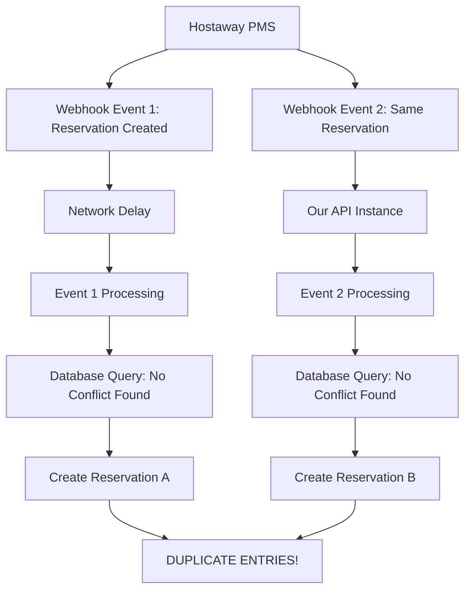
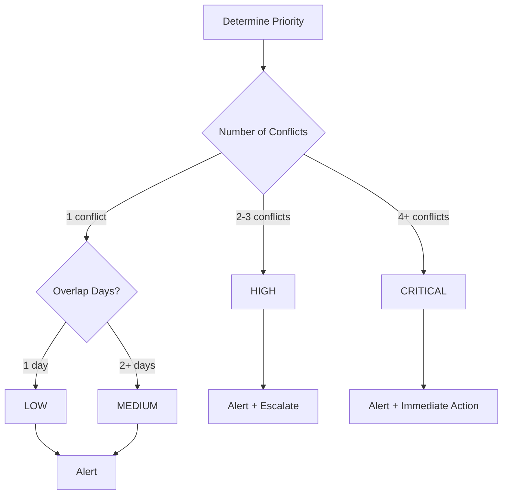
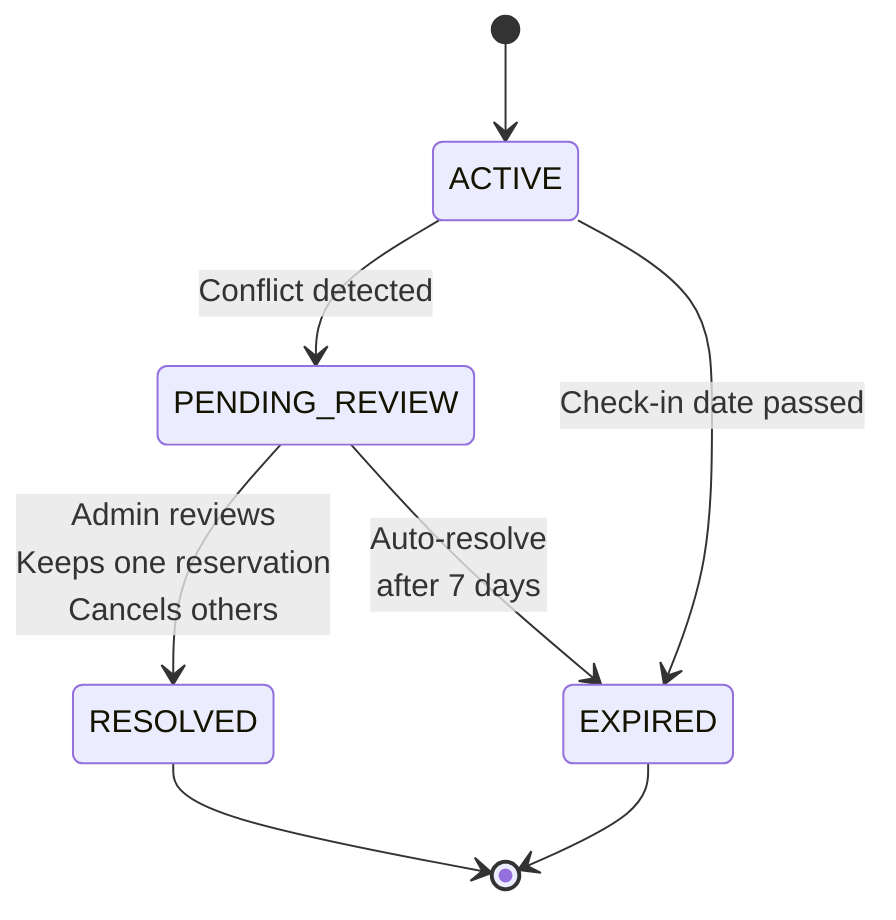
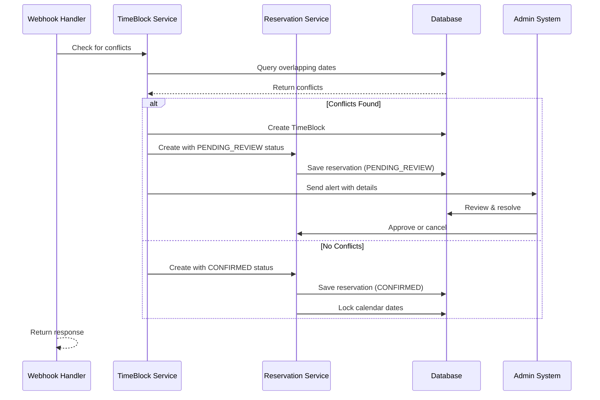

# Time-Blocking Algorithm for Duplicate Reservation Prevention

## Overview

Time-blocking is a mechanism to detect and prevent duplicate reservations when handling concurrent webhook events from the Hostaway PMS. This document provides detailed technical specifications for implementation.

---

## Problem Statement

### Scenarios Where Duplicates Occur



### Root Causes

1. **Async Processing**: Events processed in non-sequential order
2. **Network Delays**: Webhook delivery delays cause race conditions
3. **PMS Sync Issues**: Multiple systems trying to sync simultaneously
4. **Retry Storms**: Failed webhooks retried out of order

---

## Solution Architecture

### Time-Block Model

```typescript
interface TimeBlock {
  // Identification
  _id: ObjectId;
  propertyId: string;
  blockType: 'RESERVATION_BLOCK' | 'MANUAL_BLOCK' | 'MAINTENANCE';
  
  // Date Range
  checkInDate: Date;
  checkOutDate: Date;
  numberOfNights: number;
  
  // Associated Reservations
  reservationIds: string[];           // May contain multiple conflicting IDs
  primaryReservationId?: string;      // The authoritative reservation
  conflictingReservationIds: string[];
  
  // Conflict Details
  conflictType: 'EXACT_OVERLAP' | 'PARTIAL_OVERLAP' | 'ADJACENT';
  overlapDays: number;
  
  // Status & Resolution
  status: 'ACTIVE' | 'PENDING_REVIEW' | 'RESOLVED' | 'EXPIRED';
  priority: 'LOW' | 'MEDIUM' | 'HIGH' | 'CRITICAL';
  
  // Metadata
  provider: string;                  // 'hostaway', etc.
  externalReservationId: string;
  guestName: string;
  guestEmail?: string;
  notes?: string;
  
  // Audit Trail
  createdAt: Date;
  createdBy: string;                 // System or user
  resolvedAt?: Date;
  resolvedBy?: string;
  resolutionNotes?: string;
}
```

---

## Detection Algorithm

### Step 1: Extract Event Data

```javascript
function extractReservationData(event) {
  return {
    externalReservationId: event.data.reservationId,
    propertyId: event.data.id,
    guestName: event.data.guestName,
    checkInDate: new Date(event.data.checkIn),
    checkOutDate: new Date(event.data.checkOut),
    numberOfNights: calculateNights(event.data.checkIn, event.data.checkOut),
  };
}
```

### Step 2: Query Overlapping Reservations

```javascript
async function findConflictingReservations(propertyId, checkIn, checkOut, excludeId) {
  return await Reservation.find({
    propertyId: propertyId,
    status: { $ne: 'CANCELLED' },
    externalReservationId: { $ne: excludeId },  // Exclude self for updates
    $expr: {
      $and: [
        { $lt: ['$checkInDate', checkOut] },     // Existing starts before new ends
        { $gt: ['$checkOutDate', checkIn] }      // Existing ends after new starts
      ]
    }
  }).select('externalReservationId guestName checkInDate checkOutDate');
}
```

### Step 3: Classify Conflict Type

```javascript
function classifyConflict(existingCheckIn, existingCheckOut, newCheckIn, newCheckOut) {
  const conflicts = {
    exactOverlap: existingCheckIn.getTime() === newCheckIn.getTime() &&
                  existingCheckOut.getTime() === newCheckOut.getTime(),
    
    exactDateMatch: existingCheckIn.toDateString() === newCheckIn.toDateString() &&
                    existingCheckOut.toDateString() === newCheckOut.toDateString(),
    
    partialOverlapStart: newCheckIn < existingCheckOut && newCheckIn >= existingCheckIn,
    
    partialOverlapEnd: newCheckOut > existingCheckIn && newCheckOut <= existingCheckOut,
    
    completeOverlap: newCheckIn <= existingCheckIn && newCheckOut >= existingCheckOut,
    
    adjacentDates: existingCheckOut.getTime() === newCheckIn.getTime() ||
                   newCheckOut.getTime() === existingCheckIn.getTime(),
  };
  
  if (conflicts.exactOverlap || conflicts.exactDateMatch) {
    return 'EXACT_OVERLAP';
  } else if (conflicts.completeOverlap) {
    return 'COMPLETE_OVERLAP';
  } else if (conflicts.partialOverlapStart || conflicts.partialOverlapEnd) {
    return 'PARTIAL_OVERLAP';
  } else if (conflicts.adjacentDates) {
    return 'ADJACENT';  // NOT a conflict
  }
}
```

### Step 4: Calculate Overlap Days

```javascript
function calculateOverlapDays(existingStart, existingEnd, newStart, newEnd) {
  const overlapStart = Math.max(existingStart.getTime(), newStart.getTime());
  const overlapEnd = Math.min(existingEnd.getTime(), newEnd.getTime());
  
  if (overlapStart >= overlapEnd) {
    return 0;  // No overlap
  }
  
  const overlapMs = overlapEnd - overlapStart;
  return Math.ceil(overlapMs / (1000 * 60 * 60 * 24));  // Convert ms to days
}
```

---

## Time-Block Creation & Management

### Create Time-Block

```javascript
async function createTimeBlock(event, conflicts) {
  const timeBlock = new TimeBlock({
    propertyId: event.data.id,
    blockType: 'RESERVATION_BLOCK',
    checkInDate: new Date(event.data.checkIn),
    checkOutDate: new Date(event.data.checkOut),
    numberOfNights: calculateNights(event.data.checkIn, event.data.checkOut),
    reservationIds: [
      event.data.reservationId,
      ...conflicts.map(c => c.externalReservationId)
    ],
    primaryReservationId: event.data.reservationId,
    conflictingReservationIds: conflicts.map(c => c.externalReservationId),
    conflictType: classifyConflict(...),
    overlapDays: calculateOverlapDays(...),
    status: 'PENDING_REVIEW',
    priority: determinePriority(conflicts.length, overlapDays),
    provider: 'hostaway',
    externalReservationId: event.data.reservationId,
    guestName: event.data.guestName,
    createdBy: 'system',
  });
  
  await timeBlock.save();
  return timeBlock;
}
```

### Priority Determination



### Resolution Workflow



---

## Conflict Resolution Strategies

### Manual Review (Default)

```
1. Admin receives alert with conflict details
2. Reviews both reservations side-by-side
3. Decides which reservation to keep
4. Updates TimeBlock status to RESOLVED
5. Cancels conflicting reservations
6. Notifies guests of cancellation
```

### Automatic Resolution Rules (Future)

```javascript
function autoResolveConflict(timeBlock, reservations) {
  // Strategy 1: Keep earlier reservation
  const byCheckIn = reservations.sort((a, b) => 
    a.checkInDate - b.checkInDate
  );
  
  // Strategy 2: Keep reservation from authoritative source
  const fromHostaway = reservations.find(r => r.provider === 'hostaway');
  const fromOther = reservations.find(r => r.provider !== 'hostaway');
  
  // Strategy 3: Keep reservation with payment received
  const withPayment = reservations.find(r => r.paymentStatus === 'PAID');
  
  // Return the reservation to KEEP
  return withPayment || fromHostaway || byCheckIn[0];
}
```

---

## Integration with Reservation Creation



---

## Database Indexes for Performance

```javascript
// Composite index for efficient date range queries
db.timeblocks.createIndex({
  propertyId: 1,
  checkInDate: 1,
  checkOutDate: 1,
  status: 1
});

// Index for finding active blocks
db.timeblocks.createIndex({
  propertyId: 1,
  status: 1,
  checkOutDate: 1
});

// Index for finding blocks by reservation ID
db.timeblocks.createIndex({
  'reservationIds': 1,
  status: 1
});

// TTL Index to auto-expire old blocks
db.timeblocks.createIndex(
  { createdAt: 1 },
  { expireAfterSeconds: 604800 }  // 7 days
);
```

---

## Monitoring & Alerts

### Metrics to Track

```javascript
const metrics = {
  // Daily metrics
  totalWebhooks: 0,
  successfulWebhooks: 0,
  timeBlocksCreated: 0,
  conflictsDetected: 0,
  
  // By priority
  criticalBlocks: 0,
  highPriorityBlocks: 0,
  mediumPriorityBlocks: 0,
  
  // By status
  pendingReview: 0,
  resolved: 0,
  expired: 0,
  
  // Performance
  avgProcessingTime: 0,
  maxProcessingTime: 0,
};
```

### Alert Conditions

| Condition | Threshold | Action |
|-----------|-----------|--------|
| Critical priority block | Any | Immediate Slack alert |
| High priority blocks | 5+ in 24h | Email to manager |
| Pending review blocks | 10+ unresolved | Daily summary |
| Processing time | > 5000ms | Log warning |
| Conflict resolution time | > 7 days | Auto-expire & notify |

---

## Edge Cases & Handling

### Case 1: Webhook Arrives Before Previous Completes

```
Time 0:00 - RESERVATION_CREATED arrives for Res A (Jan 1-5)
Time 0:00 - Same event retried (due to connection issue)
Time 0:01 - RESERVATION_CREATED arrives for Res B (Jan 1-5)

Expected: TimeBlock created, only one reservation marked CONFIRMED
```

**Solution**: Use database transactions with optimistic locking

### Case 2: Reservation Updated with New Dates

```
Original: Res A (Jan 1-5)
Update Event: Res A now (Jan 10-15)
New Event: Res B created (Jan 1-5)

Expected: No conflict for new dates, allow Res B
```

**Solution**: Re-check conflicts on update, don't just update existing reservation

### Case 3: Both Reservations from Same Guest

```
Guest accidentally booked twice for same dates

Expected: Keep one, cancel one, notify guest
```

**Solution**: Check `guestName` or `guestEmail` for duplicate bookings

---

## Implementation Checklist

- [ ] Create TimeBlock model with all fields
- [ ] Implement conflict detection algorithm
- [ ] Add database indexes for performance
- [ ] Integrate with reservation creation flow
- [ ] Create admin interface for resolving blocks
- [ ] Set up monitoring and alerting
- [ ] Add comprehensive logging
- [ ] Write unit tests for each scenario
- [ ] Write integration tests
- [ ] Document runbooks for admins
- [ ] Set up dashboard for metrics
- [ ] Train team on resolution process

---

## Testing Scenarios

### Test Case 1: Exact Date Overlap

```javascript
it('should create TimeBlock for exact date overlap', async () => {
  // Create existing reservation: Jan 1-5
  await createReservation({
    checkIn: '2026-01-01',
    checkOut: '2026-01-05'
  });
  
  // Try to create same dates: Jan 1-5
  const event = {
    event: 'reservation.created',
    data: {
      checkIn: '2026-01-01',
      checkOut: '2026-01-05'
    }
  };
  
  const timeBlock = await handleWebhook(event);
  
  expect(timeBlock.status).toBe('PENDING_REVIEW');
  expect(timeBlock.conflictType).toBe('EXACT_OVERLAP');
});
```

### Test Case 2: Partial Overlap

```javascript
it('should detect partial overlap at start', async () => {
  await createReservation({
    checkIn: '2026-01-01',
    checkOut: '2026-01-05'
  });
  
  const event = {
    data: {
      checkIn: '2026-01-03',
      checkOut: '2026-01-07'
    }
  };
  
  const timeBlock = await handleWebhook(event);
  
  expect(timeBlock.conflictType).toBe('PARTIAL_OVERLAP');
  expect(timeBlock.overlapDays).toBe(2);  // Jan 3-5
});
```

### Test Case 3: Adjacent Dates (Should Pass)

```javascript
it('should allow adjacent dates without conflict', async () => {
  await createReservation({
    checkIn: '2026-01-01',
    checkOut: '2026-01-05'
  });
  
  const event = {
    data: {
      checkIn: '2026-01-05',
      checkOut: '2026-01-08'
    }
  };
  
  const result = await handleWebhook(event);
  
  expect(result.timeBlock).toBeUndefined();
  expect(result.reservationStatus).toBe('CONFIRMED');
});
```

---

**Version**: 1.0.0  
**Last Updated**: January 29, 2026  
**Status**: Active Implementation
